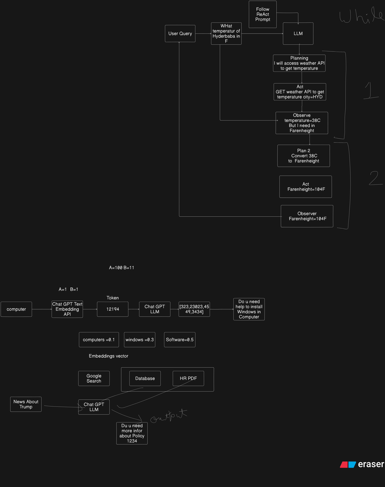

# Workshop Genai Firebase Android Kotlin Batch 1

Text Summarizer App

Add Gemini API key and ready to use

## Resources

Session Recording: [Youtube](https://youtu.be/XG2sgZ-xNE8)

Tokenizer: https://platform.openai.com/tokenizer

Token Price Calculator: https://gptforwork.com/tools/openai-chatgpt-api-pricing-calculator

Model Visualizer: https://projector.tensorflow.org/
 
Explanation : []